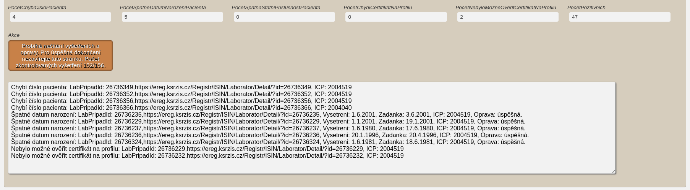

# PRO LAB Profile fixer

[Rozšíření do Mozilla Firefox](https://addons.mozilla.org/addon/pro-lab-profile-fixer)

Rozšíření přidává do ISIN kontrolu všech vyšetření, reportuje nalezené nesrovnalosti a provádí jejich částečnou automatickou opravu.

## Zásady ochrany osobních údajů

Osobní informace pacientů podmíněné přihlášením do modulu [Pacienti COVID-19](https://ereg.ksrzis.cz/Registr/CUDZadanky/VyhledaniPacienta) a webové aplikace [Žádanky testů COVID-19](https://eregpublicsecure.ksrzis.cz/Registr/CUD/Overeni) jsou použity pouze pro přidání nových funkcí zmíněných níže. Přidané funkce využívají již stávajících funkcí obou systémů. **Žádná data nejsou jakkoliv zpracovávána ani přeposílána mimo tyto systémy.**

# Použití

- je nutné být přihlášen do modulu Covid-19 (kvůli datům z profilu)
- je nutné být přihlášen do registru Žádanky Covid-19 (kvůli datům ze žádanky)

# Reportuje a zároveň automaticky provádí opravu

- neshoda datumu narození na žádance a ve vyšetření (řešení: vložení datumu narození do vyšetření ze žádanky)
- neshoda státní příslušnosti, jména a přijmení na žádance a vyšetření (řešení: ověří data jméno, přijmení a rodné číslo z vyšetření s registrem obyvatel, pokud není ve vyšetření nastavená česká státní příslušnost, a ověření bylo úspěšné, tak do vyšetření nastavení státní příslušnost CZ, pokud nebylo úspěšné, tak zkusí ověřit pomocí jména, přijmení a čísla pojištěnce ze žádanky, pokud se povede ověřit, tak vloží do vyšetření jméno, přijmení a číslo pojištěnce ze žádanky a státní příslušnost CZ, pokud ověření nebude úspěšné a data na žádance se liší od těch ve vyšetření, použije ty ze žádanky (jméno, přijmení a státní příslušnost, kterou pokud je CZ z důvodu neúspěšného ověření s registrem obyvatel ignoruje a ponechává tu ve vyšetření)
- ve vyšetření chybí / je zadaná 0 místo čísla žádanky (řešení: dohledá podle uvedeného čísla pojištěnce žádanku a pokud odpovídá typ testu a stejný den prvního odběru vzorku, vloží číslo žádanky do vyšetření)
- chybějící přístupové údaje (telefon, email) na profilu cizince (řešení: pokud na některém z nalezených profilů byl nalezen e-mail nebo telefon, tak bude použit, vyžadovaná data pro automatickou úpravu profilu kód zdravotní pojišťovny, město a psč bude použito v této posloupnosti: ze žádanky, z vyšetření, konstanty Praha 2, 12000 a samoplátce 300)

# Pouze reportuje

- ve vyšetření chybí číslo pacienta (automatické opravy zmíněné výše mohou toto opravit, automatické dohledání profilu pacienta chvilku trvá)
- chybí certifikát na profilu (automatické opravy zmíněné výše mohou toto opravit, automatické generování certifikátu na profil pacienta chvilku trvá)
- nebylo možné ověřit certifikát na profilu (typicky, protože existuje více profilů a tím pádem se nepodařilo otevřít ani jeden, protože systém žádá o upřesnění zadaných údajů)
